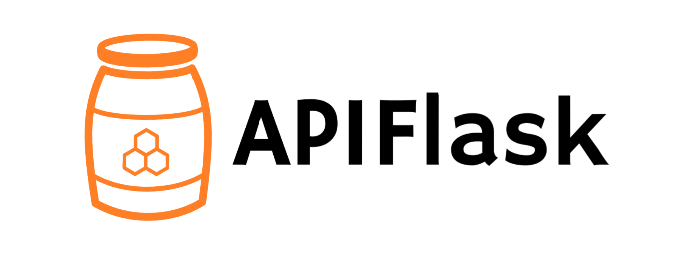
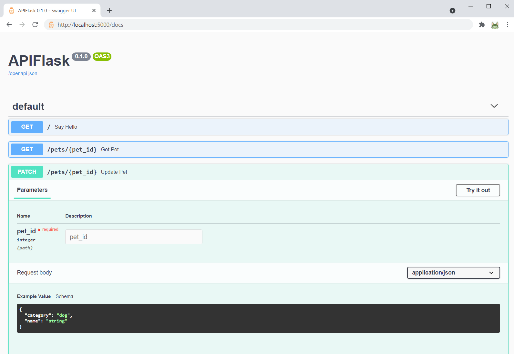
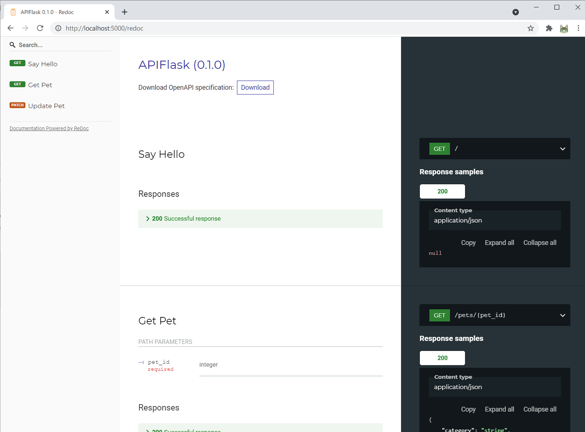

<style>
  
img {
  max-height: 680px;
  margin: auto;
}

small {
  font-size: 10px;
}

h1 {
  font-size: 60px;
}

h2 {
  font-size: 40px;
}

h5 {
  color: #ddd;
}

.grey {
  color: #ddd;
}

.root {
  font-size: 80px;
}

</style>

<h1>FastAPI Seems Good, so Why Don't We Build Something Similar For Flask?</h1>
<h2 class="grey">FastAPI Seems Good, so I Built APIFlask 🍯</h2>

<br><br><br><br>

#### Grey Li @ PyCon 2021

##### slides available at [greyli.com/slides/pycon2021](https://greyli.com/slides/pycon2021)

---
<!-- _class: invert -->

# "FastAPI has Ruined Flask Forever for Me"
##### when I search "FastAPI Flask" on Google...

---

- <a href="https://towardsdatascience.com/fastapi-has-ruined-flask-forever-for-me-73916127da">FastAPI has Ruined Flask Forever for Me</a>
<span class="grey small">Why I prefer using FastAPI instead of Flask<span>
- <a href="https://python.plainenglish.io/abandoning-flask-for-fastapi-20105948b062">Abandoning Flask for FastAPI</a>
<span class="grey small">I’m sorry Flask, but FastAPI is so much better</span>
- <a href="https://betterprogramming.pub/why-you-should-stop-using-flask-and-start-using-fastapi-1a091bfc2fbf">Why You Should Stop Using Flask and Start Using FastAPI</a>
<span class="grey small">I swear you won’t regret it</span>


##### and more on <a href="https://www.google.com/search?q=fastapi+flask">Google</a>

---

<!-- _class: invert -->

# You Shouldn't Compare FastAPI to Flask
##### but why?

---

<h1>Starlette 🍊 -> FastAPI 🍹
<h1>Flask 🍎 -> [ ❓ ]

##### copyright <a href="https://www.reddit.com/r/Python/comments/msbt3p/flask_20_is_coming_please_help_us_test/gutqpqg">reddit/flask @elephantail</a>

---

<!-- _class: invert -->

# What Should I Compare FastAPI To?
##### what's the apple juice in Flask world?

---

# Flask API Extensions

- <span class="grey">Flask-RESTful
- <span class="grey">Flask-RESTPlus
- <span class="grey">Flask-RESTX
- <span class="grey">Flask-RESTy
- <span class="grey">Flask-Rebar
- <span class="grey">flask-smorest
- <span class="grey">flask-apispec
- <span class="grey">...

---

# API Frameworks Based on Flask

- <span class="grey">Eve
- <span class="grey">Connexion
- <span class="grey">Flask-API
- **APIFlask**

---

<!-- _class: invert -->

# APIFlask is the [Apple Juice]
##### in the honey pot

---

  

---

<h1>⚡ FastAPI = Starlette + Pydantic</h2>
<h1>🍯 APIFlask = Flask + Marshmallow</h1>

---

# Main Features

- Automatic request validation and deserialization
- Automatic response formatting and serialization
- Automatic OpenAPI spec/documentations generation
- Automatic interactive API documentation

##### find more at [apiflask.com](https://apiflask.com)

---

# Minimal Application

```bash
$ pip install apiflask
```

```python
from apiflask import APIFlask

app = APIFlask(__name__)


@app.get('/')
def say_hello():
    return {'message': 'Hello!'}
```

---

<h1> Wait, What's the Difference? 🤔

---

# Key Differences

- When creating an application instance, use `APIFlask` instead of `Flask`
- When creating a blueprint instance, use `APIBlueprint` instead of `Blueprint`
- The `abort()` function from APIFlask (`apiflask.abort`) returns JSON error response
- The view class should be registered with the `route` decorator

##### see details at *[Migrating from Flask](https://apiflask.com/migrating)*

---

```python
from apiflask import Schema
from apiflask.fields import Integer, String
from apiflask.validators import Length, OneOf


class PetInSchema(Schema):
    name = String(required=True, validate=Length(0, 10))
    category = String(required=True, validate=OneOf(['dog', 'cat']))


class PetOutSchema(Schema):
    id = Integer()
    name = String()
    category = String()
```
---

```python
from apiflask import APIFlask, input, output
from flask_sqlalchemy import SQLAlchemy

from app.models import Pet
from app.schemas import PetInSchema, PetOutSchema

app = APIFlask(__name__)
db = SQLAlchemy(app)


@app.get('/pets/<int:pet_id>')
@output(PetOutSchema)  # <-- HIGHLIGHT THIS LINE
def get_pet(pet_id):
    return Pet.query.get_or_404(pet_id)


@app.patch('/pets/<int:pet_id>')
@input(PetInSchema(partial=True))  # <-- HIGHLIGHT THIS LINE
@output(PetOutSchema)  # <-- AND THIS LINE
def update_pet(pet_id, data):
    pet = Pet.query.get_or_404(pet_id)
    for attr, value in data.items():
        setattr(pet, attr, value)
    db.session.commit()
    return pet
```

---

  

---

  

---

# And More

- Authentication
- Pagination helpers
- Class-based view support
- Automatic JSON response for HTTP errors

---

# PR is Welcome

  

- apiflask.com
- github.com/greyli/apiflask

##### suggestions/feedback -> [issues/1](https://github.com/greyli/apiflask/issues/1)

---

# Credit

- Starts as a fork of **[APIFairy](https://github.com/miguelgrinberg/APIFairy)**
- Based on **[Flask](https://github.com/pallets/flask/)** and **[marshmallow-code](https://github.com/marshmallow-code)** projects (Marshmallow, Webargs, APISpec)
- Authentication support from **[Flask-HTTPAuth](https://github.com/miguelgrinberg/Flask-HTTPAuth)**
- Inspired by **[flask-smorest](https://github.com/marshmallow-code/flask-smorest)** and **[FastAPI](https://github.com/tiangolo/fastapi)**

---

# Grey Li

  

- Maintainer of Flask
- Author of APIFlask
- Technical Writer
- GitHub [@greyli](https://github.com/greyli)
- Twitter [@greylihui](https://twitter.com/greylihui)

##### find more on [greyli.com](https://greyli.com/en)
